# 피팅봇

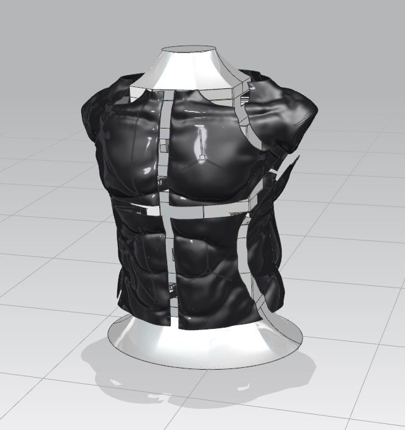

피팅봇은 하드웨어 기반의 Fashion 산업과 IT 기술 산업의 융합형 project 입니다.

##  개요 

피팅봇은 `스마트 피팅 로봇`으로  인체 치수를 입력하면, 해당 크기로 모습이 변형되는 마네킹입니다. 

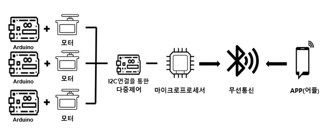

* PRT 모델링 및 STL 출력파일
* 아두이노 Master - Slave 동작코드
* Serial Monitor 및 중앙 제어 시스템

##  주요 제품기능

####  01. 마네킹 기둥설계

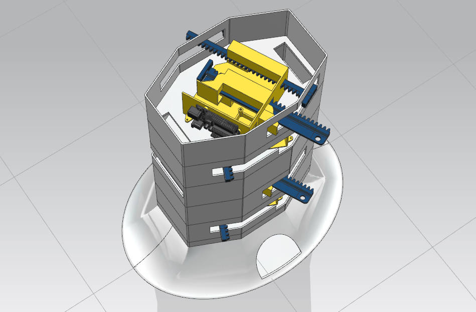
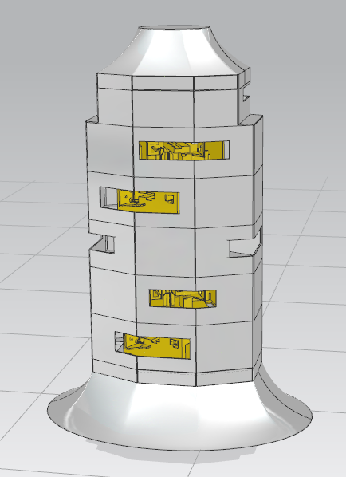
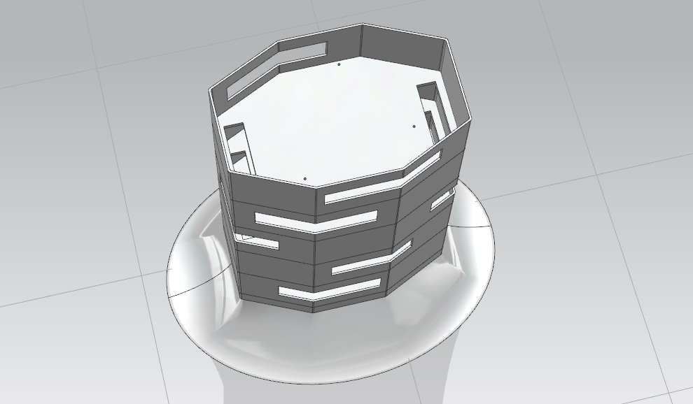

6개의 층으로 구성된 기둥을 설계하여 각 층에 모듈을 부착합니다.

####  02. 마네킹 조각 설계

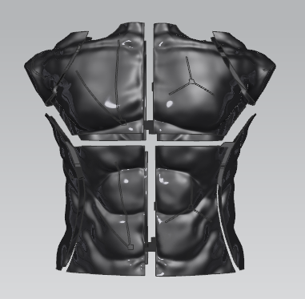
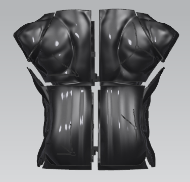

신체 형상(상체)은 12 조각으로 나누어 작동시킵니다.

####  03. 랙과 기어 설계

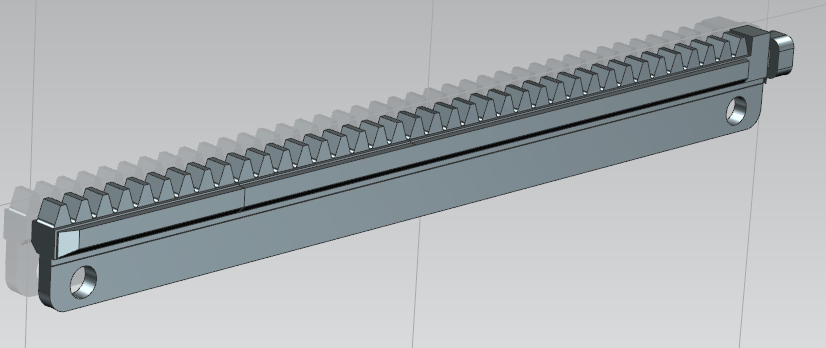
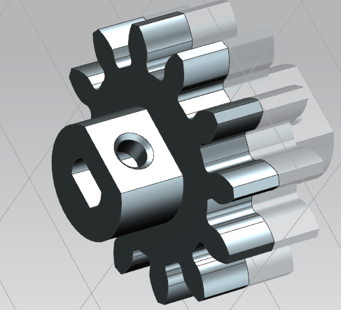

####  04. 양방향 모듈 설계

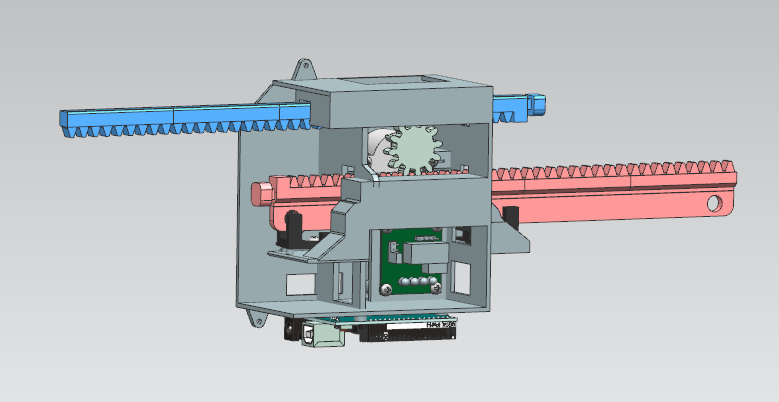
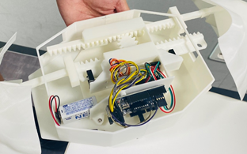

* 스텝모터, 모터 드라이버, 아두이노, 랙과 피니언 기어를 장착시킬 하나의 표준화된 모듈을 설계하여
어떠한 형상의 로봇이든 활용할 수 있습니다.
* 하나의 모터로 두개의 랙 및 조각을 움직일 수 있어 효율적입니다.

####  05. 앱인벤터로 인터페이스 제작

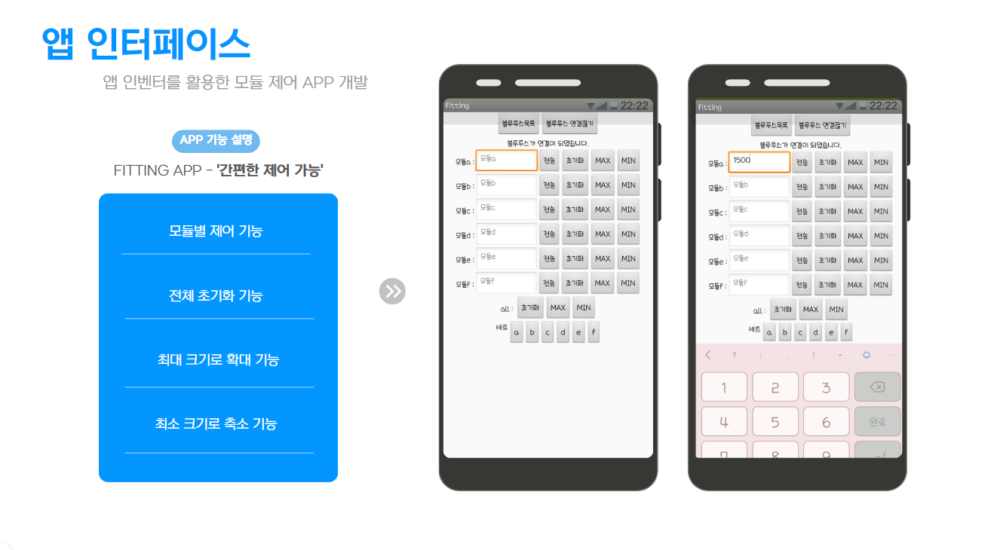

##### - 앱 사용법
1) 블루투스 목록 및 연결 끊기 기능을 이용해 아두이노와 연결합니다.
2) 모듈을 선택 후 신체 치수를 입력하면 모터가 작동하여 해당 치수만큼 랙이 이동합니다.
3) 최대, 최소 버튼을 이용해 형상을 최대화, 최소화 시킬 수 있습니다.
4) 초기화 버튼을 통해 전체 모듈을 초기값으로 되돌립니다.
​
##  기술 스택

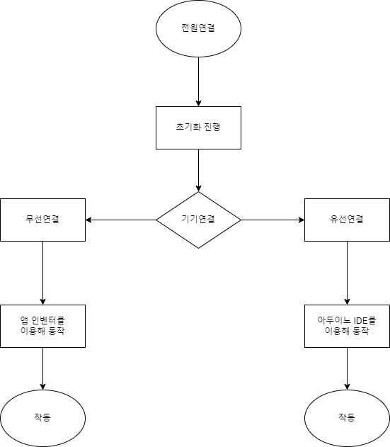

#####  - 작동 순서

1. 유/무선 연결
-  무선연결 : 블루투스 센서를 이용하여 모바일기기와 연결합니다.
-  유선연결 : 제한된 상황에 대비하여 유선연결을 지원합니다.

2-1. 치수입력
- 사용자가 신체 치수를 입력합니다.
- 유선연결의 경우엔 사용자가 모듈을 선택하는 값을 입력합니다.
- 무선연결 앱 사용자의 경우 미리 정의된 모듈의 텍스트박스 안에 수치를 입력 후 적용버튼을 클릭합니다.

2-2. 저장된 값 불러오기
- 본인이 저장한 수치값을 불러올 수 있습니다.

3. 모터작동
- 불러온 치수데이터를 기반으로 모터를 해당 값만큼 동작시킵니다.

4. 피팅더미의 크기조절
-  모터의 작동을 통해 크기를 축소, 확대 할 수 있습니다.

5. 초기화
-  포토센서를 통한 끝 렉의 끝값을 검출하는 과정을 통해 피팅더미를 초기값으로 되돌립니다.

## 작품 실물 사진

##### 3D 프린터로 출력한 기둥 및 조각 사진

