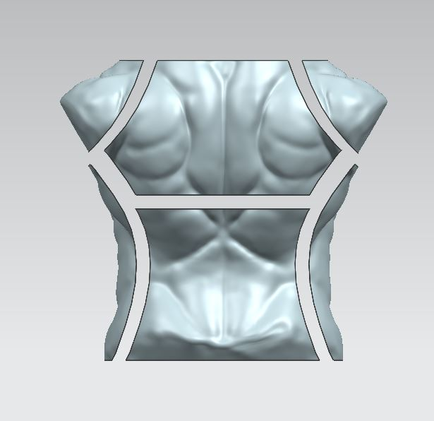
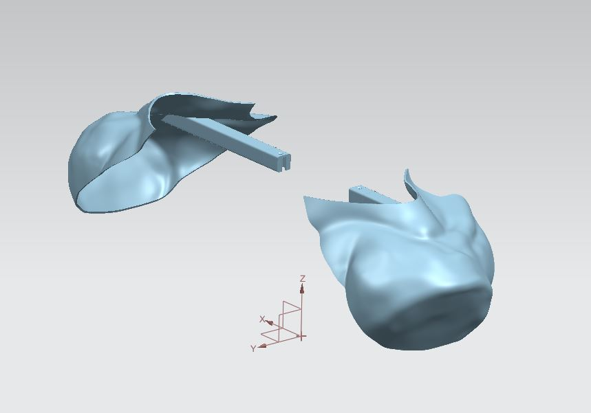
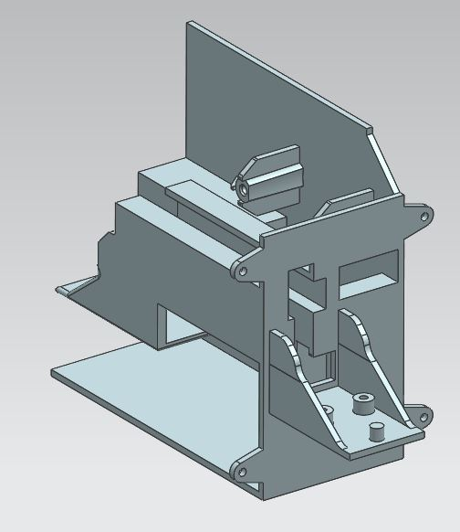
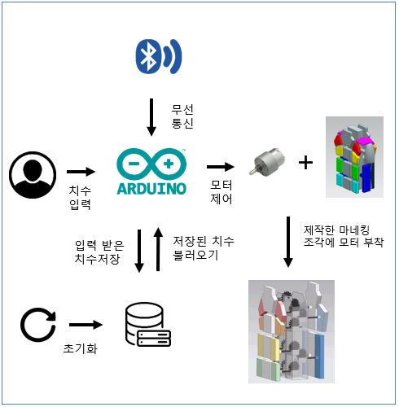
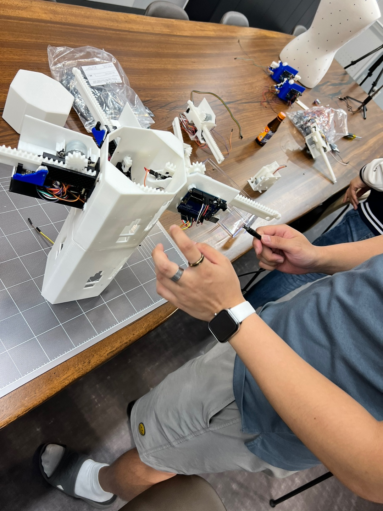

# 피팅해조

피팅해조는 하드웨어 기반의 Fashion open source project 입니다.

##  개요 

피팅해조는 `스마트 피팅로봇`으로  인체 치수를 입력하면, 해당 크기로 모습이 변형되는 Robot Open source 입니다. 

* PRT 모델링 및 STL 출력파일
* 아두이노 Master - Slave 동작코드
* Serial Monitor 및 중앙 제어 시스템

##  주요 제품기능

####  01. 마네킹 기둥설계

   

<기둥 정면>, <기둥 측면>, <기둥 후면>

####  02. 마네킹 조각 설계

 

<조각 정면>, <조각 측면>, <조각 후면>

#####  02-1 조각과 랙의 연결부위

 

<어깨에 랙과 연결될 부위를 결합한 사진>

####  03. 기어와 연결할 랙과 연결부위, 모듈 설계

 

<250mm랙>, <랙과 조각 연결부위>, <랙이 들어갈 모듈>

####  04. 앱인벤터로 인터페이스 제작

​                                                                

##  기술 스택

#####  - 작동 순서

1. 치수 입력
2. 무선 통신
3. 입력 받은 치수 저장
4. 저장된 데이터 불러오기
5. 초기화
6. 치수 조절

###  기둥과 모듈 결합

